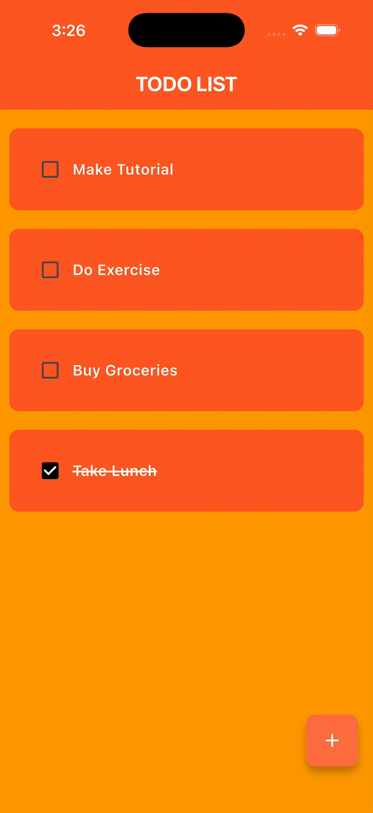

# Flutter Todo List

Flutter로 개발된 간단하고 직관적인 할 일 관리 앱입니다. Hive를 사용하여 로컬 데이터를 저장하며, 할 일 추가, 완료 표시, 삭제 기능을 제공합니다.

## 주요 기능

### ✅ 할 일 추가
플로팅 액션 버튼을 통해 새로운 할 일을 추가할 수 있습니다. 다이얼로그를 통해 할 일 내용을 입력하고 저장합니다.


### ✅ 완료 상태 토글
체크박스를 탭하여 할 일의 완료 상태를 변경할 수 있습니다. 완료된 할 일은 취소선으로 표시됩니다.



### ✅ 할 일 삭제
할 일 항목을 왼쪽으로 스와이프하면 삭제 버튼이 나타나며, 이를 통해 할 일을 삭제할 수 있습니다.


## 기술 스택

- **Flutter**: 크로스 플랫폼 모바일 앱 개발 프레임워크
- **Hive**: 빠르고 가벼운 로컬 데이터베이스
- **flutter_slidable**: 스와이프 가능한 리스트 아이템 구현

## 프로젝트 구조

```
lib/
├── main.dart                 # 앱 진입점 및 Hive 초기화
├── models/
│   └── todo.dart            # Todo 모델 및 Hive 어댑터
└── features/
    ├── todo_list.dart       # 메인 화면 및 상태 관리
    ├── todo_tile.dart       # 할 일 항목 위젯
    └── dialog_box.dart      # 할 일 추가 다이얼로그
```

## 시작하기

### 필수 요구사항

- Flutter SDK (3.10.1 이상)
- Dart SDK
- Android Studio / Xcode (모바일 개발용)

### 설치 및 실행

1. 저장소 클론
```bash
git clone <repository-url>
cd flutter_todolist
```

2. 의존성 설치
```bash
flutter pub get
```

3. 앱 실행
```bash
flutter run
```

## 주요 의존성

- `hive: ^2.2.3` - 로컬 데이터베이스
- `hive_flutter: ^1.1.0` - Flutter용 Hive 통합
- `flutter_slidable: ^3.1.1` - 스와이프 가능한 리스트 아이템

## 기능 상세

### 데이터 저장
- Hive를 사용하여 앱을 종료해도 할 일 목록이 유지됩니다
- 초기 실행 시 샘플 데이터 3개가 자동으로 추가됩니다

### UI/UX
- 깔끔한 오렌지 컬러 테마
- 직관적인 플로팅 액션 버튼
- 스와이프 제스처를 통한 삭제 기능
- 완료된 할 일의 시각적 피드백 (취소선)

## 라이선스

이 프로젝트는 개인 학습 및 포트폴리오 목적으로 제작되었습니다.
